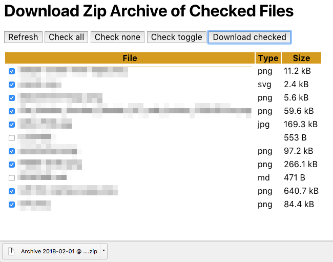

# Download Zip Archive of Checked Files

Display a list of files with checkboxes which allows a selection of those
files to be downloaded as a Zip archive.

In this example, some files are ignored from the directory scan, including
`.php`, `.ht*`, `.DS_*`, `.zip`, and `.git*`.

- JavaScript
    - [fetch API](https://fetch.spec.whatwg.org/)
    - [querySelector](https://dom.spec.whatwg.org/#dom-parentnode-queryselector)
- PHP
    - [Zip extension](http://php.net/zip)
